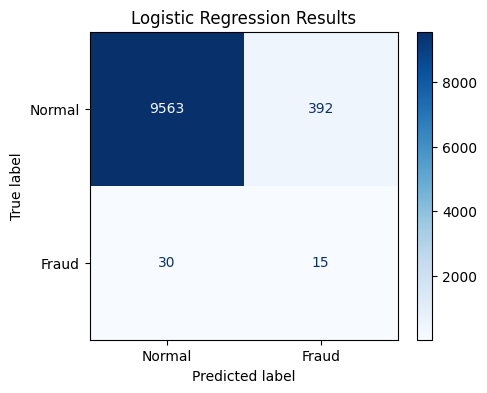
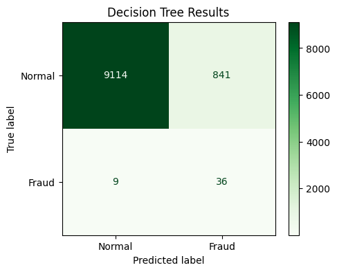
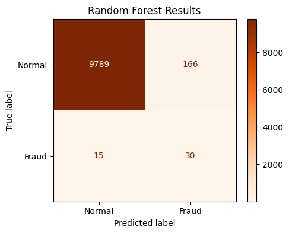
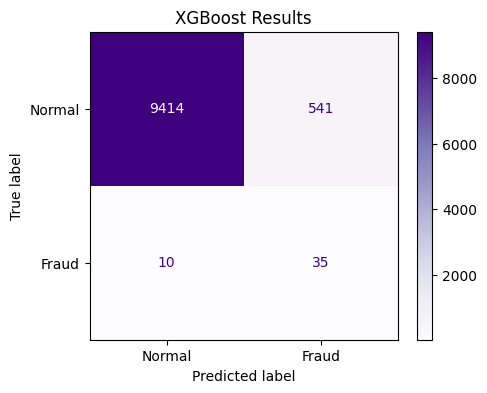

# 🛡️ Next-Gen Fraud Detection Architecture: From Baselines to Deep Autoencoders

## 📖 Executive Summary
This project builds an end-to-end, professional-grade Machine Learning architecture designed to detect highly camouflaged credit card fraud. Rather than relying on a single algorithm, this project tracks the evolution of a "Model Showdown," progressing from standard linear baselines up to a **Two-Tier Defense System** utilizing both Sequential Gradient Boosting (XGBoost) and Unsupervised Deep Learning (Autoencoders) to catch "Zero-Day" cyberattacks.

## ⚠️ The Data Science Challenges
Working with financial fraud data presents three massive technical hurdles that standard ML tutorials often ignore. This project directly solves all three:
1. **The "Time-Travel" Trap (Data Leakage):** Standard random `train_test_split` functions allow models to "look into the future" to predict the past. This project enforces strict chronological splitting to simulate a real-world production environment.
2. **Extreme Class Imbalance:** Fraud represents less than 1% of the dataset. If unaddressed, models will simply guess "Normal" 100% of the time.
3. **Hacker Camouflage (Ping-and-Drain):** Modern cybercriminals spread their attacks out to blend in with normal transaction frequencies.

## ⚙️ Advanced Feature Engineering (The Secret Sauce)
To break the hacker camouflage, two highly specific behavioral features were engineered:
* **Cyclical Time Trigonometry (`time_sin`, `time_cos`):** Machine learning models don't understand that 11:59 PM and 12:01 AM are two minutes apart; they see them as 24 hours apart. By bending the 24-hour clock into a mathematical circle using Sine and Cosine, the algorithms can accurately detect late-night behavioral anomalies.
* **Transactional Velocity (`seconds_since_last_txn`):** Calculated by sorting user IDs chronologically and measuring the exact time delta between swipes to catch rapid-fire "card testing" attacks.

## 🏗️ The Model Showdown (Architecture Evolution)
The project evaluates seven different architectures to empirically prove the best deployment strategy:

### Phase 1: The Supervised Baselines
* **Logistic Regression:** The linear baseline. Failed to cleanly separate the complex, non-linear cyclical time features, resulting in high false-positive rates.
* **Decision Tree:** The non-linear detective. Successfully utilized "If/Then" logic to map velocity and time, drastically improving the F1-Score.
* **Random Forest:** The parallel ensemble. Utilized "Bootstrap Aggregating" (100 trees voting blindly) to eliminate the bias and overfitting of the single tree.

### Phase 2: The Supervised Champion
* **XGBoost:** The sequential SWAT team. By utilizing Gradient Descent, each tree in the sequence was built specifically to patch the mathematical errors of the previous tree. With heavily tuned `scale_pos_weight` parameters, this served as the ultimate **Tier 1 Defense** for catching known hacker profiles.

### Phase 3: Deep Learning & The Unsupervised Safety Net
Supervised models have a fatal flaw: they can only catch what they have seen before. To protect against brand-new, "Zero-Day" cyberattacks, we built an Unsupervised Shadow Net:
* **Multi-Layer Perceptron (MLP):** A standard Deep Learning brain. Struggled due to the lack of native class-weight balancing for tabular data.
* **Deep Autoencoder (The Masterpiece):** An unsupervised neural network trained *exclusively* on normal human behavior. By forcing data through a mathematical bottleneck, it learns to perfectly reconstruct normal transactions. When a camouflaged hacker enters the system, the network's math breaks, causing a massive spike in **Reconstruction Error (MSE)**, triggering the trap.
* **Isolation Forest:** An unsupervised tree-based anomaly detector that drops random mathematical partitions to isolate bizarre behavior in real-time.

## 🚀 Final Business Deployment Strategy
Instead of relying on one model, the optimal business recommendation is a **Two-Tier System**:
1. **Tier 1 (Real-Time Blocking):** **XGBoost** sits on the front lines. If it recognizes a known attack pattern, the transaction is instantly declined.
2. **Tier 2 (The Shadow Net):** The **Deep Autoencoder** and **Isolation Forest** run silently in the background. If a transaction passes XGBoost but triggers a massive anomaly threshold (Reconstruction Error), it is not automatically blocked (to prevent false alarms for normal users acting weirdly), but is instead silently flagged and sent to a human fraud investigator.

## 🛠️ Tech Stack
* **Language:** Python 3.x
* **Data Manipulation:** Pandas, NumPy
* **Machine Learning:** Scikit-Learn, XGBoost
* **Deep Learning:** TensorFlow, Keras
* **Visualization:** Matplotlib 

## 📊 Visualizing the Model Showdown (Confusion Matrices)

*(Note: The following matrices visually demonstrate the evolution of the defense architecture. Notice how the models struggle with the camouflaged hackers early on, before XGBoost and the Neural Network tighten the net.)*

### 1. The Linear Baseline: Logistic Regression

### 2. The Non-Linear Detective: Decision Tree

### 3. The Parallel Ensemble: Random Forest

### 4. The Sequential Champion: XGBoost

### 5. The Deep Learning Brain: Artificial Neural Network (MLP)
.png)